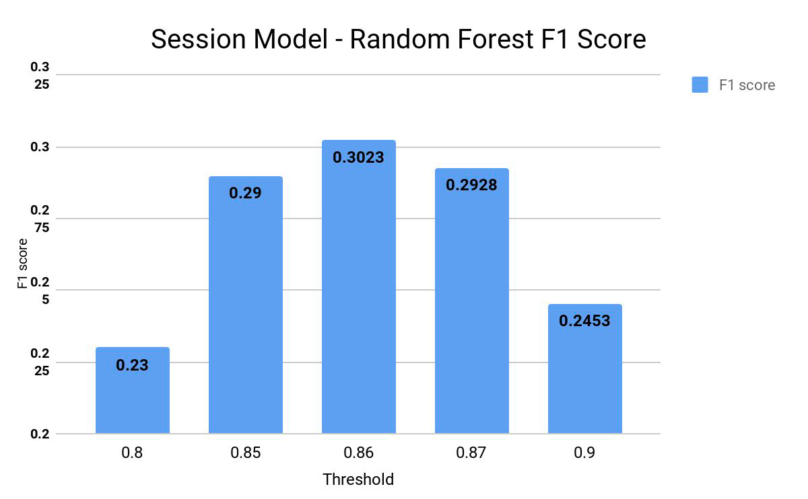

# Clickstream-Based-Recommendation-And-Prediction
Various ML models developed in Scala Programming Language for purchase predictions and recommendations using user's stream of clicks

# OVERVIEW
This project is about predicting the items a user will buy in a given stream of clicks performed by
him/her in a session. Here, a solution to the 2015 RecSys challenge is presented. The work is
based a large scaled dataset of over 9.2 million user-item click sessions. Items recommendations
is also done for a given session based on collaborative filtering.

# GOALS
The main goal of this project is to develop a machine learning model to determine which
visits will end up with a purchase and if there is a purchase in a given clickstream session
then the second goal is to predict the items that will be purchased.

Here a two-stage approach to item classification from user sessions is used:
1. To predict whether a session will contain a purchase.
2. To predict the items which will be purchased given a session contains a purchase.

3. Another goal is to use collaborative filtering to develop a primary recommendation system
model to recommend items to a user based on his/her clickstream of clicks

# Approach Towards Model Design
Probabilistic Approach:
As described in the [report](https://github.com/sankalpapharande/Clickstream-Based-Recommendation-And-Prediction/blob/main/Sankalp-Internship-Report.pdf), here a two-stage approach to item classification from user sessions is used:
1. To predict whether a session will contain a purchase.
2. To predict the items which will be purchased given a session contains a purchase.
We develop a session model for binary classification of sessions and item model to predict
whether a given item was bought in that session.

Overall Workflow Diagram:

Note:Corresponding session features are passed as a raw input along with item features in item model

# Classification Model Development
Classification model development consist of following parts:
1. Calculations of features
2. Feature scaling
3. Model Training:
   1. Logistic Regression 
   2. Random Forest 
   3. Gradient Boosted Trees 
   4. Neural Networks

Details about Feature calculation, feature scaling and model training is described in the [report](https://github.com/sankalpapharande/Clickstream-Based-Recommendation-And-Prediction/blob/main/Sankalp-Internship-Report.pdf).

# Results

### Results of Classification Model: Session Model
1. Logistic Regression: With 500 no of iteration:
   1. Precision = 0.45
   2. Recall = 0.07
   3. F1 score = 0.1211
2. Random Forest with 100 no of trees in random forest:
   1. feature subset strategy = 0.5
   2. Precision = 0.2387
   3. Recall = 0.2983
   4. F1 score = 0.2652
3. Gradient Boosted Trees
   1. Precision = 0.3517
   2. Recall = 0.101
   3. F1 score = 0.1530
4. Neural Networks
   1. Precision = 0.44
   2. Recall = 0.074
   3. F1 score = 0.1267

Session Model Performance on various ML algorithms

Best Results were given by Random Forest. After proper parameter tuning, the F1 score for
session model was improved to 0.3023

Random Forest-Session Model Performance

## Results of classification Model: Item Model
Best Results for Item classification were also derived from Random Forest.
Parameters:
* No of Trees : 400 
* Probability Classification Threshold : 0.89 
* Feature Subset Strategy : 0.8
##### Best F1 score achieved : 0.2603

Random Forest-Item Model Performance
